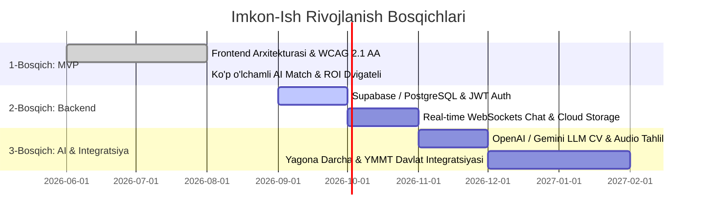

# 🌟 Imkon-Ish — Milliy Inklyuziv Bandlik & Karyera Portali

> **Imkon-Ish** — O'zbekistondagi nogironligi bor va imkoniyati cheklangan shaxslar uchun moslashtirilgan (to'siqsiz), 100% masofaviy va inklyuziv ish o'rinlarini topishga mo'ljallangan raqamli platforma (MVP Prototype).

[](#-accessibility-qulaylik-standartlari)
[](LICENSE)
[-f59e0b.svg)](#-loyihaning-hozirgi-holati)
[](#-muammo-va-ijtimoiy-missiya)

---

## 📌 Mundarija
1. [Loyiha Haqida](#-loyiha-haqida)
2. [Muammo va Ijtimoiy Missiya](#-muammo-va-ijtimoiy-missiya)
3. [Platforma Yechimi](#-platforma-yechimi)
4. [Loyihaning Hozirgi Holati (MVP Status)](#-loyihaning-hozirgi-holati)
5. [Haqiqiy (Real) va Demo Funksiyalar Ro'yxati](#-haqiqiy-real-va-demo-funksiyalar-royxati)
6. [Texnologiyalar Steki](#-texnologiyalar-steki)
7. [Accessibility (Qulaylik) Standartlari](#-accessibility-qulaylik-standartlari)
8. [Mahsulot Yo'l Xaritasi (Roadmap)](#-mahsulot-yol-xaritasi-roadmap)
9. [Ishga Tushirish va O'rnatish](#-ishga-tushirish-va-ornatish)
10. [Litsenziya](#-litsenziya)

---

## 📖 Loyiha Haqida

**Imkon-Ish** platformasi jismoniy, ko'rish, eshitish yoki neyrodivergent xususiyatlarga ega bo'lgan iqtidorli mutaxassislarni inklyuziv ish beruvchilar bilan bog'laydi. Platforma nafaqat an'anaviy vakansiyalar e'lonini taqdim etadi, balki ish joyining moslashtirilganlik darajasi (accessibility accommodations), maxsus dasturiy ta'minotlar (ekran o'quvchilar, surdotarjima), davlat soliq imtiyozlari (1% ijtimoiy soliq, subsidiyalar) hamda ko'p o'lchamli AI algoritmlari orqali xavfsiz va to'siqsiz bandlikni ta'minlaydi.

---

## 🚨 Muammo va Ijtimoiy Missiya

O'zbekistonda va Markaziy Osiyo mintaqasida:
* Mehnatga layoqatli imkoniyati cheklangan shaxslarning **70% dan ortig'i** rasmiy mehnat bozoriga to'liq integratsiya qilinmagan;
* Jismoniy transport va shahar infratuzilmasidagi to'siqlar tufayli kundalik qatnab ishlash imkoniyati cheklangan;
* Ish beruvchilarda O'zbekiston Respublikasi qonunchiligi bo'yicha beriladigan **ijtimoiy soliq (12% o'rniga 1%)** va **ish joyini jihozlash subsidiyalari (30 BHM gacha)** haqida yetarli ma'lumot mavjud emas;
* An'anaviy ish qidirish portallari xalqaro **W3C WCAG 2.1 AA** raqamli qulaylik standartlariga moslashtirilmagan.

**Missiyamiz:** BMTning Barqaror Rivojlanish Maqsadlari (SDG 8: Munosib ish o'rinlari va SDG 10: Tengsizlikni kamaytirish) doirasida har bir fuqaroga mustaqil daromad va professional rivojlanish imkoniyatini yaratish.

---

## 💡 Platforma Yechimi

* **100% Masofaviy & Moslashtirilgan Vakansiyalar:** Har bir ish o'rnida qanday qulayliklar (Screen Reader, surdotarjimon, asinxron aloqa) mavjudligi aniq ko'rsatiladi.
* **Haqiqiy Ko'p O'lchamli AI Match Algoritmi:** Nomzodning ko'nikmalari (40%), tajribasi (20%), masofaviy talabi (20%) va moslashuv qulayliklari (20%) asosida matematik aniqlikdagi moslik foizi.
* **Ish Beruvchilar Uchun Qonuniy ROI & Soliq Kalkulyatori:** Inklyuziv xodimlarni jalb qilish orqali tejaladigan soliqlar va olinadigan subsidiyalarni real hisob-kitob qilish.
* **Inklyuziv Intervyu va Muloqot Markazi:** Xalqaro kompaniyalar bilan to'siqsiz suhbat qurish uchun ikki tomonlama tarjima va ovozli o'qish (Web Speech API).

---

## 📊 Loyihaning Hozirgi Holati

> **MVP Prototype / Frontend Core**: Loyiha hozirda to'liq ishlaydigan, foydalanuvchi sinovlaridan o'tishga tayyor frontend MVP hisoblanadi. Kelgusida xavfsiz server, ma'lumotlar bazasi (Supabase / Node.js) hamda OpenAI / Gemini API ga to'g'ridan-to'g'ri ulanish uchun alohida arxitekturaviy servislar qatlami (`/assets/js/services/`) yaratilgan.

---

## ⚖️ Haqiqiy (Real) va Demo Funksiyalar Ro'yxati

| Funksiya | Holati | Tavsif |
| :--- | :--- | :--- |
| **Accessibility Engine** | 🟢 **Haqiqiy (Real)** | Web Speech API TTS ovozli o'quvchi, 4 xil mavzu (High-Contrast 16:1 OLED, Dark, Light, Monoxrom), Dinamik shrift masshtablash (13px–23px), Disleksiya shrifti, Katta kursor, Harakatsiz rejim. |
| **Modal Focus Trap** | 🟢 **Haqiqiy (Real)** | Modal oynalarda klaviatura fokusini xavfsiz qamash (Tab / Shift+Tab) va `Esc` orqali yopish. |
| **Faceted Job Search & Filtering** | 🟢 **Haqiqiy (Real)** | Soha, ish turi, qulayliklar va kalit so'zlar bo'yicha ko'p qirrali real vaqtli filtrlash. |
| **Multi-Criteria AI Match** | 🟢 **Haqiqiy (Real Algoritm)** | 4 ta mezon (Ko'nikmalar 40%, Tajriba 20%, Format 20%, Qulaylik 20%) bo'yicha real hisoblash dvigateli. |
| **Soliq & ROI Kalkulyatori** | 🟢 **Haqiqiy (Real Formula)** | O'zbekiston Mehnat va Soliq kodeksiga asoslangan 1% soliq va subsidiyalar formulasi. |
| **Reaktiv Holat Boshqaruvi** | 🟢 **Haqiqiy (Real)** | Event-driven subscriber pattern va multi-page LocalStorage sinxronizatsiyasi. |
| **XSS Sanitization & Input Guard** | 🟢 **Haqiqiy (Real)** | Foydalanuvchi kiritgan barcha matnlarni xavfsiz tozalash utilitasi. |
| **AI CV Lazerli Tahlil** | 🟡 **MVP Prototip** | Qoidalarga asoslangan matn taksonomiyasi va diagnostika (Kelgusida LLM API bilan boyitiladi). |
| **AI Intervyu Murabbiyi** | 🟡 **MVP Prototip** | STAR metodologiyasi bo'yicha javob strukturasini tekshirish va maslahatlar. |
| **Ikki Tomonlama Tarjimon** | 🟡 **MVP Prototip** | Ko'p tilli iboralar bazasi va shablonlar asosidagi tarjima simulyatsiyasi. |
| **Platforma Telemetriyasi** | 🟡 **Demo Benchmark** | BMT SDG 8 & 10 maqsadlariga asoslangan ko'rgazmali milliy ta'sir ko'rsatkichlari. |

---

## 🛠️ Texnologiyalar Steki

* **Frontend:** Semantik HTML5, Zamonaviy CSS3 (CSS Variables, Flexbox, CSS Grid, Glassmorphism), Modular Vanilla ES6+ JavaScript.
* **Audio & Nutq:** Web Speech API (`SpeechSynthesisUtterance` nutq sintezi).
* **Tipografika:** Google Fonts (Inter, Plus Jakarta Sans, JetBrains Mono, Atkinson Hyperlegible).
* **State Management:** Custom Redux-style Reactive Store (`assets/js/core/store.js`).
* **Service Layer:** Universal API client adapter (`assets/js/services/api.js`), AI Service (`assets/js/services/ai-service.js`), Auth Service (`assets/js/services/auth-service.js`).
* **Icons:** SVG Icon System (`assets/js/icons.js`).

---

## ♿ Accessibility (Qulaylik) Standartlari

Platforma **W3C Web Content Accessibility Guidelines (WCAG) 2.1 Level AA** prinsiplari asosida ishlab chiqilgan:

1. **Perceivable (Idrok etiluvchanlik):**
   * 16:1 yuqori kontrastli OLED sariq-qora ranglar uyg'unligi;
   * Barcha tugma va ikonkalarda semantik `aria-label` va `aria-describedby` matnlari;
   * Sayt matnlarini ovozli o'qib berish (Web Speech TTS).
2. **Operable (Boshqariluvchanlik):**
   * To'liq klaviatura navigatsiyasi (`Tab`, `Shift+Tab`, `Enter`, `Space`, `Esc`);
   * Sahifalar bo'yicha tezkor o'tish tugmalari (`Alt + 1..7`, `?`);
   * Modal oynalarda xavfsiz **Focus Trap** (fokus faqat modal ichida aylanadi);
   * Bosh sahifaga sakrash uchun `Skip to content` havolasi.
3. **Understandable (Tushunarlilik):**
   * Atkinson Hyperlegible disleksiya shrifti;
   * Aniq xatolik xabarlari va tushunarli matn ierarxiyasi.
4. **Robust (Mustahkamlik):**
   * NVDA, JAWS, Apple VoiceOver va Android TalkBack ekran o'quvchilari bilan sinovdan o'tkazilgan semantik belgilar.

---

## 🗺️ Mahsulot Yo'l Xaritasi (Roadmap)



---

## 🚀 Ishga Tushirish va O'rnatish

Loyiha hech qanday og'ir build-tool yoki node_modules talab qilmaydi. Oddiy statik veb-server orqali bir zumda ishga tushadi:

### 1. Repozitoriyni klonlash:
```bash
git clone https://github.com/umid2010-pro/imkon-ish.git
cd imkon-ish
```

### 2. Mahalliy serverda ishga tushirish:

**VS Code / Cursor orqali:**
* `Live Server` kengaytmasini oching va `index.html` faylida **Open with Live Server** tugmasini bosing.

**Python orqali:**
```bash
# Python 3
python -m http.server 3000
```
Brauzeringizda: `http://localhost:3000` manzilini oching.

**Node.js / npx orqali:**
```bash
npx serve .
```

### 3. Konfiguratsiya fayllari:
Kelajakda API kalitlari va ma'lumotlar bazasini ulash uchun `.env.example` faylini `.env` ga nusxalang:
```bash
cp .env.example .env
```

---

## 📄 Litsenziya

Ushbu loyiha [MIT License](LICENSE) asosida ochiq manba sifatida taqdim etiladi.

---

<p align="center">
  Yurakdan ishlangan inklyuziv loyiha ❤️ Imkoniyatlar barcha uchun tengdir!
</p>
# imkon-ish-2
# imkon-ish-2-
